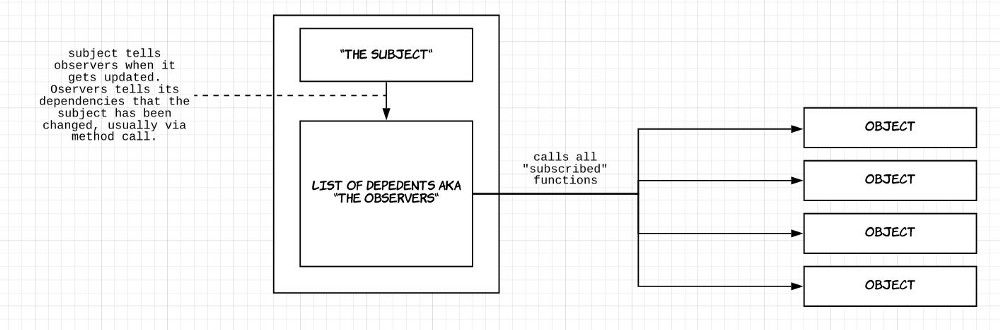

# Observer Pattern:
The observer pattern consists of three ingredients — the “subject”, the observer, and the objects.

The relationship between these three ingredients works like this: think of the subject as the central piece of code that ultimately controls the running of everything. The observer acts as a holding list for all the relevant objects.

The Observer Pattern is a popular pattern used across all sorts of JavaScript applications. The instance (subject) maintains a collection of objects (observers) and notifies them all when changes to the state occurs.

Imagine that you have to update multiple elements simultaneously when some event occurs (typing inside the input field perhaps). You need to be able to add more (subscribe) elements that react (observe) to a change of an input value. Removing subscriptions (unsubscribe) can be handy if you no longer need to broadcast state changes to a particular object.

When building web apps you end up writing many event handlers. Event handlers are functions that will be notified when a certain event fires. These notifications optionally receive an event argument with details about the event (for example the x and y position of the mouse at a click event).

The event and event-handler paradigm in JavaScript is the manifestation of the Observer design pattern. Another name for the Observer pattern is Pub/Sub, short for Publication/Subscription.



## Exemple:
```
// define a class
class Observable {
  // each instance of the Observer class
  // starts with an empty array of things (observers)
  // that react to a state change
  constructor() {
    this.observers = [];
  }

  // add the ability to subscribe to a new object / DOM element
  // essentially, add something to the observers array
  subscribe(f) {
    this.observers.push(f);
  }

  // add the ability to unsubscribe from a particular object
  // essentially, remove something from the observers array
  unsubscribe(f) {
    this.observers = this.observers.filter(subscriber => subscriber !== f);
  }

  // update all subscribed objects / DOM elements
  // and pass some data to each of them
  notify(data) {
    this.observers.forEach(observer => observer(data));
  }
}
```

# The Node.js Event Emitter
If you worked with JavaScript in the browser, you know how much of the interaction of the user is handled through events: mouse clicks, keyboard button presses, reacting to mouse movements, and so on.

On the backend side, Node.js offers us the option to build a similar system using the events module.
This module, in particular, offers the EventEmitter class, which we'll use to handle our events.

You initialize that using:
```
    const EventEmitter = require('events')
    const eventEmitter = new EventEmitter()
```
This object exposes, among many others, the on and emit methods.

+ `emit` is used to trigger an event
+ `on` is used to add a callback function that's going to be executed when the event is triggered

For example, let's create a `start` event, and as a matter of providing a sample, we react to that by just logging to the console:
```
eventEmitter.on('start', () => {
  console.log('started')
})

```

When we run:

```
eventEmitter.emit('start')
```

the event handler function is triggered, and we get the console log.

You can pass arguments to the event handler by passing them as additional arguments to `emit()`:

```
eventEmitter.on('start', number => {
  console.log(`started ${number}`)
})

eventEmitter.emit('start', 23)
```

Multiple arguments:
```
eventEmitter.on('start', (start, end) => {
  console.log(`started from ${start} to ${end}`)
})

eventEmitter.emit('start', 1, 100)
```

## Bibligraphy:

+ https://www.dottedsquirrel.com/observer-pattern-javascript/
+ https://pawelgrzybek.com/the-observer-pattern-in-javascript-explained/
+ https://www.oreilly.com/library/view/learning-javascript-design/9781449334840/ch09s05.html
+ https://www.dofactory.com/javascript/design-patterns/observer
+ https://nodejs.dev/learn/the-nodejs-event-emitter
+ https://nodejs.org/api/events.html