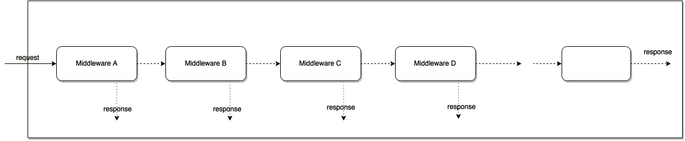

# MIDDLEWARE

Middleware makes triggers a function for the objects provided as arguments to modify this objects (acts like a filter).

Middleware can be made as a Function or as a Class (see the documentation)

## Basic Middleware Pattern in JavaScript
In Express, we have the middleware functions with this signature:
```
const middleare = (req, res, next) => {
// do stuffs
next()
}
```

In Koa, we have this:
```
const middleware = (ctx, next) => {
// do stuffs
next()
}
```

Basically, you have some objects (`req`, `res` for Express or `ctx` for Koa) and a `next()` function as the arguments of the middleware function. When `next()` is called, the next middleware function is invoked. If you modify the argument objects in the current middleware function, the next middleware will received those modified objects. For example:
```
// Middleware usage in Koa

app.use((ctx, next) => {
ctx.name = 'Doe'
next()
})

app.use((ctx, next) => {
console.log(ctx.name) // will log `Doe`
})

app.use((ctx, next) => {
// this will not get invoked
})
```

And if you don’t call the `next()` function, the execution stops there and the next middleware function will not be invoked.

### Implementation
So, how do you implement a pattern like that? With 30 lines of JavaScript:
```
function Pipeline(...middlewares) {
const stack = middlewares

const push = (...middlewares) => {
    stack.push(...middlewares)
}

const execute = async (context) => {
    let prevIndex = -1

    const runner = async (index) => {
    if (index === prevIndex) {
        throw new Error('next() called multiple times')
    }

    prevIndex = index

    const middleware = stack[index]

    if (middleware) {
        await middleware(context, () => {
        return runner(index + 1)
        })
    }
    }

    await runner(0)
}

return { push, execute }
}
```

### Usage
```
// create a middleware pipeline
const pipeline = Pipeline(
// with an initial middleware
    (ctx, next) => {
        console.log(ctx)
        next()
    }
)

// add some more middlewares
pipeline.push(
    (ctx, next) => {
        ctx.value = ctx.value + 21
        next()
    },
    (ctx, next) => {
        ctx.value = ctx.value * 2
        next()
    }
)

// add the terminating middleware
pipeline.push((ctx, next) => {
    console.log(ctx)
    // not calling `next()`
})

// add another one for fun ¯\_(ツ)_/¯
pipeline.push((ctx, next) => {
    console.log('this will not be logged')
})

// execute the pipeline with initial value of `ctx`
pipeline.execute({ value: 0 })
```
If you run that piece of code, can you guess what the output will be? Yeah, you guessed it right:
```
{ value: 0 }
{ value: 42 }
```
By the way, this would absolutely work with async middleware functions too.

## Understanding the Middleware Pattern in Express.js
In Express.js: Middleware functions are functions that have access to the request object (req), the response object (res), and the next middleware function in the application’s request-response cycle. The next middleware function is commonly denoted by a variable named next.

A middleware function has the following signature:
```
function(req, res, next) { ... }
```
There is a special kind of middleware named error-handling. This kind of middleware is special because it takes four arguments instead of three allowing Express to recognize this middleware as error-handling:
```
function(err, req, res, next) {...}
```
### Middleware functions can perform the following tasks:
+ Logging requests
+ Authenticating/authorizing requests
+ Parsing the body of requests
+ End a request – response lifecycle
+ Call the next middleware function in the stack.

### Request-response lifecycle through a middleware is as follows:


### This pattern has some benefits:
+ Avoid coupling the sender of a request to the receiver by giving more than one object a chance to handle the request. Both the receiver and the sender have no explicit knowledge of each other.
+ Flexibility in distributing responsibilities among objects. We add or change responsibilities for handling a request by adding to or changing the chain at run-time.

## Bibliography:
1. https://muniftanjim.dev/blog/basic-middleware-pattern-in-javascript/
2. https://dzone.com/articles/understanding-middleware-pattern-in-expressjs